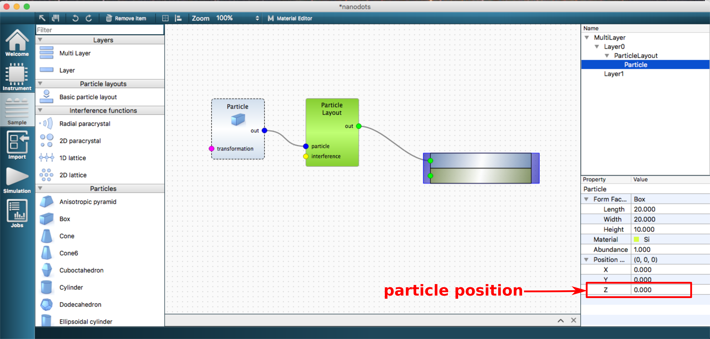
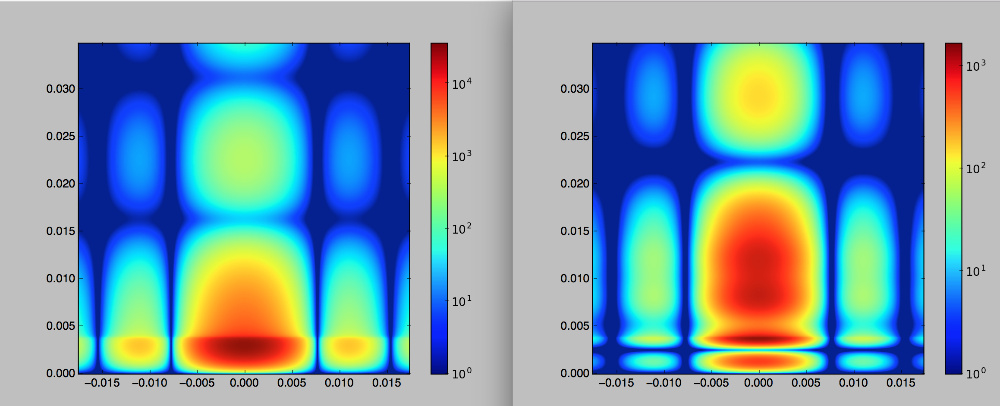
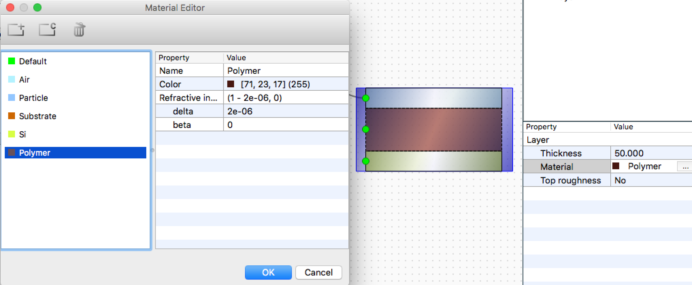

#Exercise 2: Particle positioning
## Tasks
1. Check the particle position in the air layer. Where are the particles?
2. Shift the particles to be 10 nm above the air layer bottom. Compare simulation results with previous simulation.
3. Create an intermediate layer with parameters:
	- Material: $\delta = 2\times 10^{-6}$, $\beta = 1.3\times 10^{-8}$ 
	- Thickness = 50 nm
4. Attach particle layout to this layer. Check the particle position. Is it physical? What values would be correct?
5. Vary particle positions in the intermediate layer: place particles on the bottom, in the middle, on the top of the layer. **Beware: BornAgain 1.7.0 does not support particles placed between the layers.**


Particle positioning [documentation](http://bornagainproject.org/documentation/usage/scripting/particles_positioning).

## Solution
### Check the particle position in the air layer. Where are the particles?


Particles are placed on the top of the substrate.

In Python script particle position is not set. In BornAgain $Z=0$ by default.

### Shift the particles to be 10 nm above the air layer bottom. 
Set $Z=10$ to place the particles 10 nm above the substate layer.
In Python it can be done like:

```python
particle_1 = ba.Particle(material_2, formFactor_1)
particle_1_position = kvector_t(0.0*nm, 0.0*nm, 10.0*nm)
particle_1.setPosition(particle_1_position)

```
### Compare simulation results.


### Create an intermediate layer


In Python, following lines need to be added to the `get_sample()` function:

```python
# define new material
material_3 = ba.HomogeneousMaterial("Polymer", 2e-06, 1.3e-8)

# Defining Layers
layer_1 = ba.Layer(material_1)
layer_2 = ba.Layer(material_3, 50)
layer_3 = ba.Layer(material_2)
```

Add layer to the multilayer from top to bottom. Pay attention that the layer numbering has been changed.

```python
# Defining Multilayers
multiLayer_1 = ba.MultiLayer()
multiLayer_1.addLayer(layer_1)
multiLayer_1.addLayer(layer_2)
multiLayer_1.addLayer(layer_3)
```

### Attach particle layout to this layer. Check the particle position.


The value $Z = 10$ nm is suitable for the top layer, but not for the intermediate layer. For the intermediate layer correct values are in the range from `-1*particle height` (particle touches the top of the layer) to `-1*layer thickness` (particle is ob the bottom of the layer). In the present example the correct range for $Z$ is from -10 to -50 nm.

The full Python script for simulation of particles on the bottom of the intermediate polymer layer should look like this:

```python
import numpy
import bornagain as ba
from bornagain import deg, angstrom, nm, kvector_t

def getSample():
    # Defining Materials
    material_3 = ba.HomogeneousMaterial("Si", 7.6e-06, 1.7e-07)
    material_2 = ba.HomogeneousMaterial("Polymer", 1.99999999995e-06, 1.3e-08)
    material_1 = ba.HomogeneousMaterial("Air", 0.0, 0.0)

    # Defining Layers
    layer_1 = ba.Layer(material_1)
    layer_2 = ba.Layer(material_2, 50)
    layer_3 = ba.Layer(material_3)

    # Defining Form Factors
    formFactor_1 = ba.FormFactorBox(20.0*nm, 20.0*nm, 10.0*nm)

    # Defining Particles
    particle_1 = ba.Particle(material_3, formFactor_1)
    particle_1_position = kvector_t(0.0*nm, 0.0*nm, -50.0*nm)
    particle_1.setPosition(particle_1_position)

    # Defining Particle Layouts and adding Particles
    layout_1 = ba.ParticleLayout()
    layout_1.addParticle(particle_1, 1.0)
    layout_1.setTotalParticleSurfaceDensity(1)

    # Adding layouts to layers
    layer_2.addLayout(layout_1)

    # Defining Multilayers
    multiLayer_1 = ba.MultiLayer()
    multiLayer_1.addLayer(layer_1)
    multiLayer_1.addLayer(layer_2)
    multiLayer_1.addLayer(layer_3)
    return multiLayer_1

def getSimulation():
    simulation = ba.GISASSimulation()
    simulation.setDetectorParameters(800, -1.0*deg, 1.0*deg, 800, 0.0*deg, 2.0*deg)
    
    simulation.setBeamParameters(0.154*nm, 0.2*deg, 0.0*deg)
    simulation.setBeamIntensity(1.0e+08)
    return simulation


def plot(intensities):
    import matplotlib.colors
    from matplotlib import pyplot as plt
    im = plt.imshow(intensities.getArray(), norm=matplotlib.colors.LogNorm(1, intensities.getMaximum()), extent=[-1.0*deg, 1.0*deg, 0.0*deg, 2.0*deg]) 
    plt.colorbar(im)
    plt.show()


def simulate():
    # Run Simulation
    sample = getSample()
    simulation = getSimulation()
    simulation.setSample(sample)
    simulation.runSimulation()
    return simulation.getIntensityData()


if __name__ == '__main__': 
    ba.simulateThenPlotOrSave(simulate, plot)

```

### Vary particle positions in the intermediate layer: place particles on the bottom, in the middle, on the top of the layer.
Consider thickness of the polymer layer to be 50 nm and particle height 10 nm. Particle positions:

- on the bottom of the polymer layer $Z=-50$ nm
- in the middle of the layer $Z=-25$ nm
- touching the top of the layer $Z=-10$ nm.
